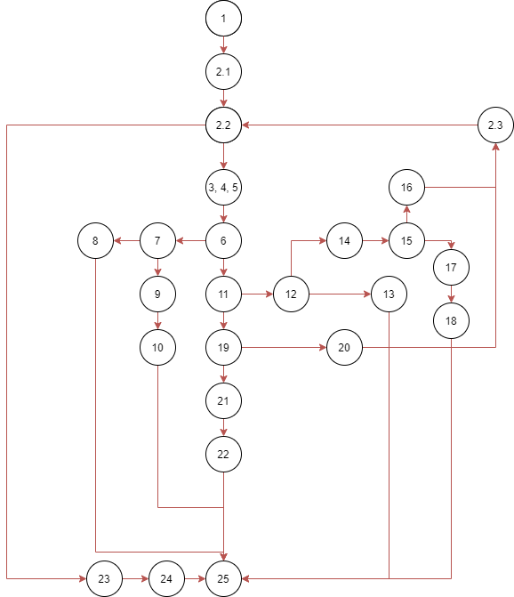

# SI_lab2_196001
Втора лабораториска вежба по Софтверско инженерство
Милан Тасевски, 196001

1. Control FLow Graph\

2. Цикломатската комплексност на кодот е 8. Формулата по која се пресметтува е E - V + 2, каде E е бројот на ребра, V е бројот на темиња на графот. Во нашиот случај E - V + 2 = 31 - 25 + 2 = 8
3. Според Multiple Condition критериумот ги гледаме сите сложени if услови. Такви ги има 4:  
        
        3.1.  if (hr < 0 || hr > 24) [јазол 6]
              TX  (-1, 45, 45)
              FT  (25, 14, 14)
              FF  (4, 5, 6)
        3.2.  if (min < 0 || min > 59) [јазол 12]
              TX  (22, -1, 15)
              FT  (22, 61, 15)
              FF  (4, 5, 6)*
              *Тест случајот (4, 5, 6) e истиот како и погоре, некои тест случаи поминуваат низ неколку услови
              па може да ги користиме истите, за да се намали нивниот број. Таквите тест случаи се означени со *.
        3.3. if (sec >= 0 && sec <= 59)
              FX  (22, 15, -1)
              TT  (4, 5, 6)*
              TF  (22, 15, 61)
        3.4.  else if (hr == 24 && min == 0 && sec == 0) [јазол 19]
              TTT (24, 0, 0)
              TTF (24, 0, 1)
              TFX (24, 13, 13)
              FXX / Не постои таков тест случај
4. Според Every branch критериумот со помош на Excel табелата EveryBranch.xlsx ги пишуваме сите тест случаи. Целта е во најмал број на тест случаи да се опфатат сите ребра во графот. Соодветните тест случаи се:
        
       празна листа 
       (-1, 45, 45) 
       (25, 45, 45) 
       (22, -2, 2) 
       (22, 2, -2) 
       (22, 2, 2) 
       (24, 0, 0) 
       (24, 2, 2)
 
(Забелешка: тест случаите се креирани со по еден елемент во листата, нивниот број може да се скрати ако пратиме листа со повеќе елементи (со тоа што треба да внимаваме на Exceptions). Таков пример би било спојување на 6тиот и 7миот тест случај)

5. Oбјаснување за unit тестовите:
   Имплементација на две функции за да се опфатат двата критериуми: EveryBranch(), MultipleCondition(). За враќање на листа се имплементира листа со точниот резултат во неа и се повикува assertEquals(result, lab.function(list)). За тест случаите каде треба да се фрли исклучок, решението е со try catch блок, па се споредува соодветната порака.
